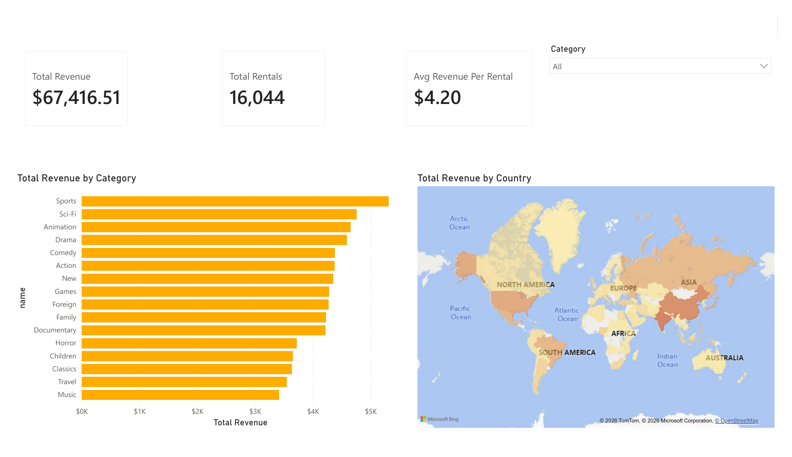
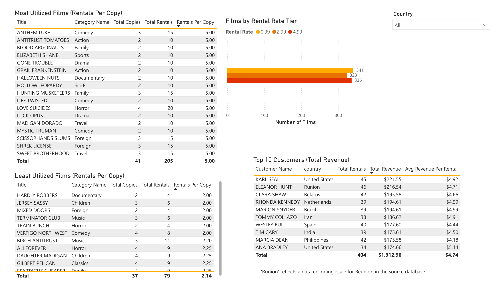

# Sakila DVD Rental: SQL + Power BI Dashboard

A two-page Power BI dashboard built on the Sakila DVD rental sample database, analyzing revenue, customer value, and inventory efficiency — with findings cross-validated against SQL before being trusted in any visual.

**Revenue Overview**

**Films & Customers**

## Project overview

This project analyzes the [Sakila database](https://github.com/bradleygrant/sakila-sqlite3), a sample relational database modeling a fictional DVD rental store — films, categories, inventory, customers, rentals, and countries. As with this portfolio's other relational projects, the analysis required joining across multiple tables rather than working from a single flat file.

The goal was to:
1. Write and validate SQL queries directly against the database (SQLite, via DB Browser for SQLite)
2. Cross-validate all totals against SQL before building any Power BI visuals
3. Build a two-page dashboard: a revenue overview, and a deeper dive into film inventory efficiency and top customers
4. Surface genuine patterns in the data rather than forcing a narrative — including flagging where the data itself has quirks

## Tools used

- **SQL (SQLite, DB Browser)** — querying, joining, and validating totals ahead of dashboard build
- **Power BI Desktop** — data modeling, DAX measures, dashboard design

## Process

1. **SQL analysis** (see `sakila_analysis_queries.sql`): six documented queries, progressing from a single-table row count through a 5-table join chain (Payment → Rental → Inventory → Film → Film_Category → Category) and a 4-hop geography chain (Customer → Address → City → Country).
2. **Export to CSV**: tables were exported from SQLite and re-imported into Power BI — a deliberate simplification for a portfolio project, with the trade-off (no live refresh from the source database) noted rather than hidden.
3. **Data model**: 9 relationships connecting 9 tables, with `rental` at the center of the revenue chain and `address`/`city`/`country` extending the customer geography chain.
4. **Cross-validation**: every DAX measure was checked against its SQL equivalent before being used in a visual. Total Revenue ($67,416.51), Total Rentals (16,044), and all per-category totals matched to the cent.
5. **Deliberate handling of orphaned data**: 5 payment records exist with null `rental_id` values (possibly fees or adjustments). These were included in KPI card totals (real revenue) but excluded from category-level visuals (no meaningful category to assign them to) — a deliberate decision rather than a silent omission.

## Key findings

- **Sports is the highest-revenue category ($5,314); Music is the lowest ($3,418)**, with all totals matching SQL validation exactly.
- **Rental rate shows no meaningful correlation with film length, replacement cost, or rating.** Three fixed tiers exist ($0.99 / $2.99 / $4.99, roughly evenly split at ~320–340 films each), but testing all three obvious candidate drivers — average film length, average replacement cost, and rating distribution — showed essentially no variation across tiers. Pricing appears to have been assigned without a systematic driver captured in this schema.
- **Inventory turnover is unusually uniform across a large slice of the catalog.** The "Most Utilized Films" table returns 17 titles rather than 10, because every one of them is tied at exactly 5.00 rentals per copy. This is a genuine data pattern, not a filtering bug — Power BI's Top N filter keeps all tied values, and an artificial tiebreaker was deliberately not introduced to force a clean count of 10.
- **Underperforming titles are spread across genres**, not concentrated in one category — inventory inefficiency isn't a single-category problem.
- **The U.S. is the strongest single market**, with meaningful revenue spread across Europe, South America, and Asia rather than concentrated in one region.
- **Top customers vary meaningfully in both rental frequency and spend efficiency.** Unlike Chinook (where every top-10 customer had an identical order count of 7), Sakila's top customers range from 34 to 46 rentals — a real spread. ANA BRADLEY has the highest average revenue per rental ($5.14) despite ranking 10th by total spend, suggesting she consistently picks higher-priced films rather than simply renting more often.
- **A real data-quality issue surfaced and was kept, not hidden.** "Runion" in the Top Customers table reflects a character-encoding issue for Réunion (a French island territory) in the source database — flagged directly on the dashboard rather than silently corrected.

## A note on scope

- The Top N filters on the utilization tables intentionally return more than 10 rows where ties exist, rather than introducing an artificial tiebreaker to force an exact count of 10. Table titles describe the actual metric shown rather than implying a clean cutoff.
- 5 payments with null `rental_id` values are included in overall revenue totals but excluded from category-level analysis. This is disclosed rather than hidden, consistent with the approach taken across this portfolio.
- Power BI connects to CSV exports of the Sakila tables rather than a live ODBC connection to the SQLite database — a deliberate simplification that means the dashboard does not refresh dynamically from the source.

## Files in this repo

| File | Description |
|---|---|
| `Sakila_DVD_Rental_PowerBI.pbix` | Power BI dashboard file |
| `sakila_analysis_queries.sql` | Documented SQL queries with findings, validated against the SQLite database |
| `Sakila_Raw_Data/` | CSV exports of the 9 tables used in the Power BI model |
| `screenshots/` | Dashboard page exports |

## Possible next steps

- Add a Year/Month breakdown of rentals to check for seasonality in demand
- Compare inventory levels against utilization to identify whether under-stocked titles represent a missed-revenue opportunity or are evenly distributed noise
- Correct the Réunion encoding issue at the source and re-validate the Top Customers table
- Investigate what actually drives the three-tier pricing structure — the schema doesn't capture it, but a real store's pricing logic presumably exists somewhere
